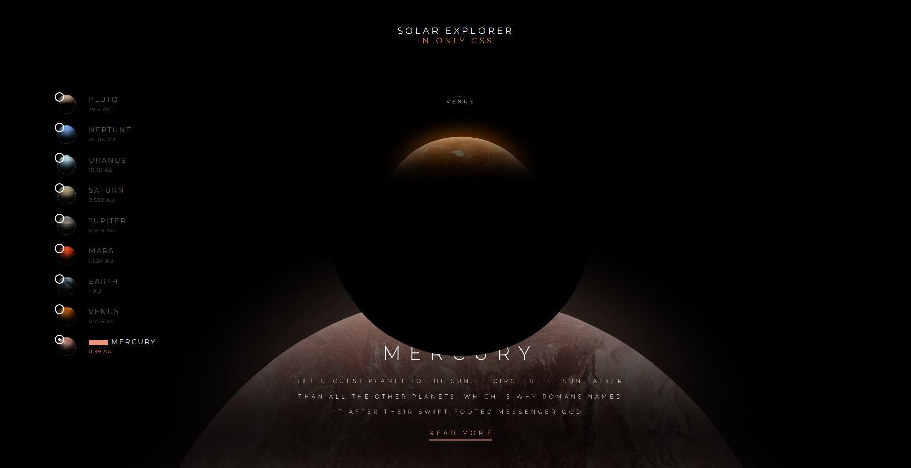

# Solar Systam

Bem-vindo ao Solar System Explorer! Este projeto oferece uma maneira interativa de explorar o universo. Utilizando tecnologias como HTML, CSS e SCSS, o Solar System Explorer cria uma experiência imersiva que permite navegar pelos planetas e outros corpos celestes do nosso sistema solar.

## Tecnologias Usadas 📦

*HTML

*CSS

*scss

## 💻 Layout
 

<h1> Tela Principal <h1>

  

